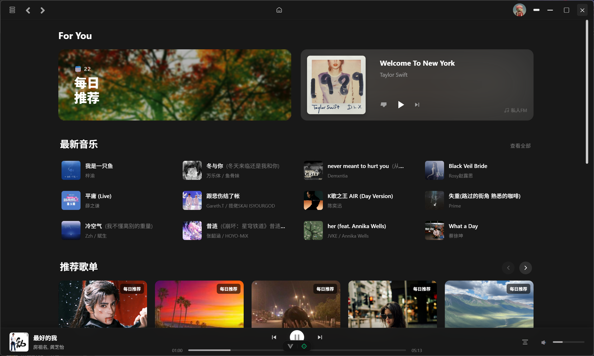

# **PoloMusic**

基于vue3 + Electron的音乐播放器，数据由第三方网易云api获取。

## 功能

------

- 支持网易账号登录（手机 / 邮箱 / 扫码 / cookie） ps: 手机、邮箱和扫码登录目前由于api限制无法完美支持。
- 支持类显示AppleMusic歌词页面
- 支持每日推荐歌单、私人FM ps: 私人FM由于每次请求只有两三首歌曲信息，在监听下一首行为加入了再次请求，但是功能不完美，短时间内请求得到的数据一样所以等于没办法一直添加歌曲。
- 支持最新音乐推荐
- 支持推荐歌单
- 支持精选歌单
- 支持关闭应用保存上次播放信息（进度、播放列表）
- ...更多功能还在开发中

## 灵感来源

------

[网易云音乐](https://music.163.com/)

[yesplaymusic](https://github.com/qier222/YesPlayMusic)